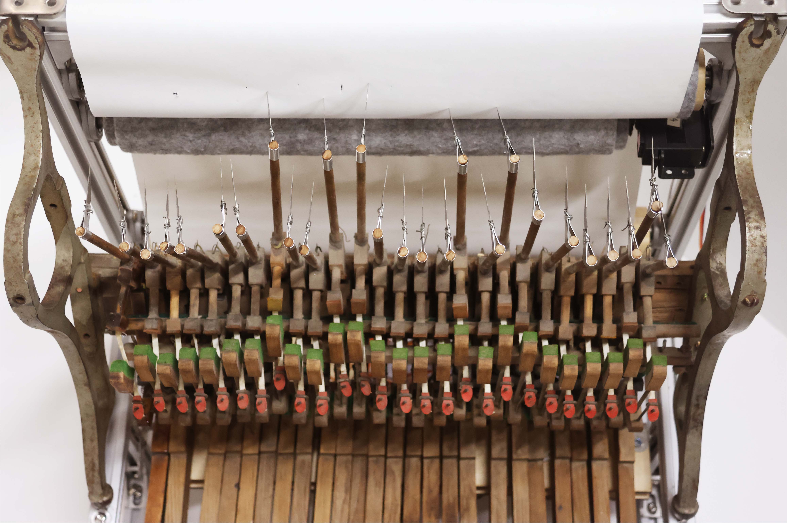
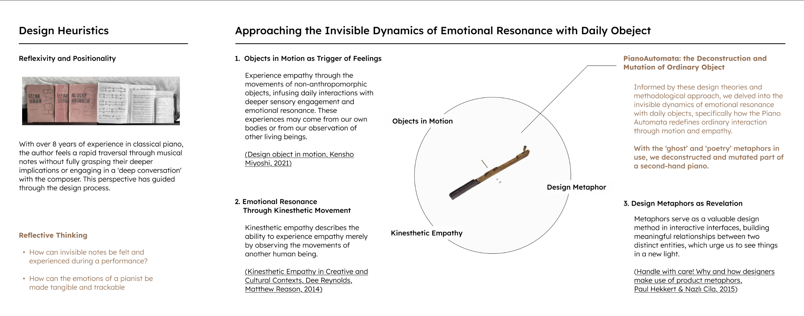
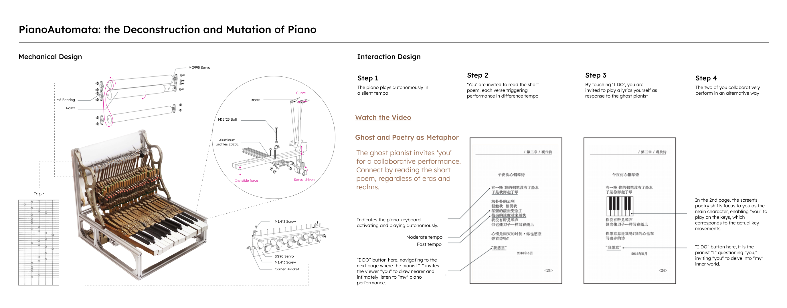
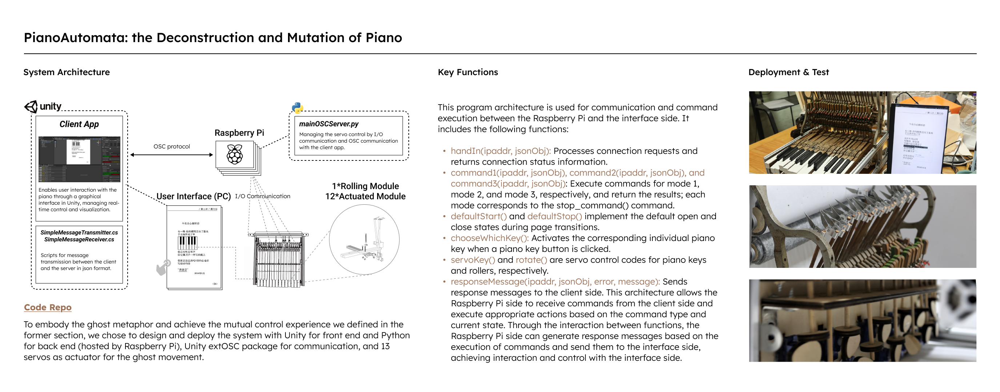

# PianoAutomata
Course work for Intelligent Hardware and System Development, Jun 2023. For more details about this work, visit at https://yukizhuyue.com/the-dawns-here-are-quiet/.

# Overview
PianoAutomata is an automated system of piano-playing. The system includes a Raspberry Pi for interfacing with the piano keys, servos as actuators, and sensors to detect key presses and movements. The software components are primarily developed using Unity and the extOSC package for communication.

